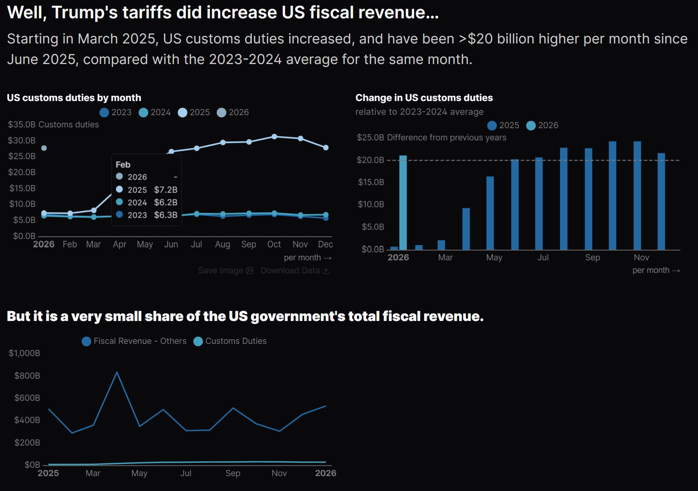

# US Tariff: What didn't and What did do

**[Please find the report here.](https://bchaoss.github.io/US-Tariff-What-Didnt-and-What-Did/)**




## Source of Data

- [U.S. Census Bureau, International Trade Datasets](https://www.census.gov/data/developers/data-sets/international-trade.html)

- [U.S. Department of the Treasury, Monthly Treasury Statement](https://fiscaldata.treasury.gov/datasets/monthly-treasury-statement/)

- [U.S. Bureau of Labor Statistics](https://www.bls.gov/)

Or, Use my transfered dataset in `MotherDuck` by the share link:

```sql
-- Run this snippet to attach database in MotherDuck
ATTACH 'md:_share/us_tariff/5e5d7ce4-fe48-487a-a05f-2dd92e9ac43d';
```

## Reference

- [Do Trump's Tariffs Make Sense? Douglas A.Irwin, Hayek Lecture Series](https://www.youtube.com/watch?v=rGafYjEqWWs&t=879s)

- [Has Trump Actually Shrunk the Trade Deficit? TLDR News Global](https://www.youtube.com/watch?v=PWV3bFIh-go&t=221s)

- [What are tariffs, and why are they rising? | Brookings](https://www.brookings.edu/articles/what-are-tariffs-and-why-are-they-rising/)

- [Tariffs as a Major Revenue Source: Implications for Distribution and Growth | CEA | The White House](https://archive.ph/e6NMH)


***
##  Get start

Dependences: 
[dbt](https://www.getdbt.com/), [duckdb](https://duckdb.org/) ([MotherDuck](https://www.motherduck.com/)), [Evidence BI](https://github.com/evidence-dev/evidence?tab=readme-ov-file).

Clone the repository and set up the development environment by `.devcontainer`, then run the following commands to build the data pipeline and reports:

### dbt Pipeline
```bash
cd pipeline
dbt build
dbt docs generate
```

### Reports
```bash
cd reports
npm run sources
npm run build 
```


## Sructure
<pre>
.
├── ingest/
├── data/
│
├── pipeline/
│   ├── analyses/
│   ├── macros/
│   ├── models/
│   ├── seeds/
│   ├── tests/
│   ├── dbt_project.yml
│   └── profiles.yml
│
├── reports/
│   ├── .evidence/customization
│   ├── build/
│   ├── pages/
│   ├── scripts/
│   ├── sources/
│   ├── evidence.config.yaml
│   ├── package-lock.json
│   └── package.json
│
├── .devcontainer/
├── .github/workflows
└── requirements.txt
</pre>